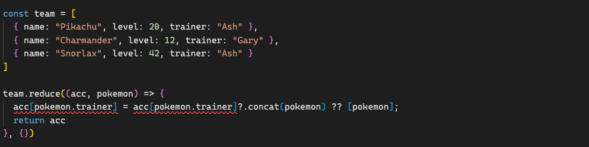
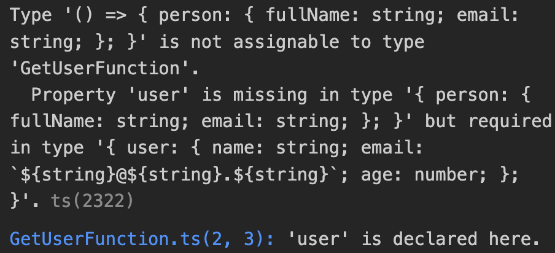
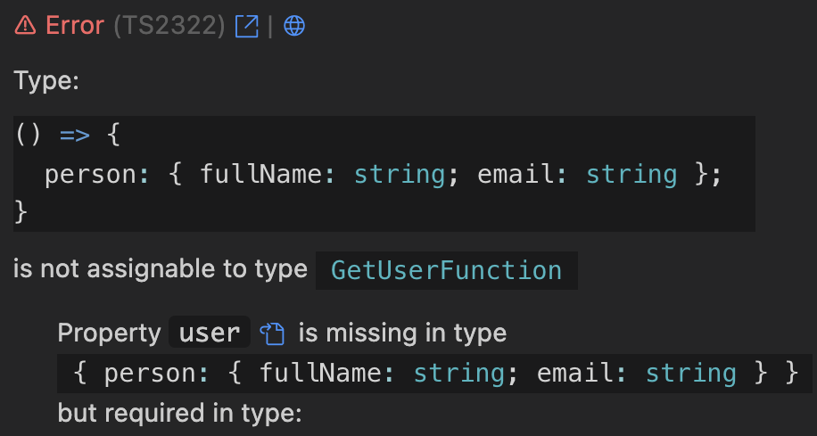

# Perks of being a Polyglot

How to improve your typescript code by learning other languages.

---

## About me

- I'm [Andre](https://www.linkedin.com/in/andre-wru/) :D
- Senior Software Engineer at Interhyp
- Fullstack with more experience in the frontend
- I love all sorts of languages!

---

> Learning another language is not only learning different words for the same things, but learning another way to think about things.
> &mdash; Flora Lewis

---

### Usage according to Stackoverflow

- 64% Javascript
- 39% Typescript
- 13% Rust
- 9% Kotlin
- 2% Elixir

---

### Popularity by subreddit size

- 2.4m Javascript
- 296k Rust
- 129k Typescript
- 82k Kotlin
- 30k Elixir

---

## Java

3 billion devices run Java every day!

---

## Just kidding :p

Java inspired me to dabble with Kotlin though.

---

## Kotlin

[Kotlin](https://kotlinlang.org/) was developed by Jetbrains as an easily implementable, interoperable replacement for Java.

---

## Kotlin - Comfort functions

Example:

Given a team of pokémon, calculate the total sum of all levels.

```typescript
const team = [
  { name: "Pikachu", level: 20, trainer: "Ash" },
  { name: "Charmander", level: 12, trainer: "Gary" },
  { name: "Snorlax", level: 42, trainer: "Ash" }
]
 ```

---

## In Typescript

 ```typescript
team.reduce((acc, { level }) => acc + level, 0)

// result: 74
 ```

---

## In Kotlin

`team.sumOf { it.level }`

So comfy :D

---

## Now let's spice it up a bit...

Given a team of pokémon, group them by their trainer.

```typescript
const team = [
  { name: "Pikachu", level: 20, trainer: "Ash" },
  { name: "Charmander", level: 12, trainer: "Gary" },
  { name: "Snorlax", level: 42, trainer: "Ash" }
]
 ```

 ---

## A bit less elegant In Typescript

 ```typescript
const result = team.reduce((acc, pokemon) => {
  acc[pokemon.trainer] = acc[pokemon.trainer]?.concat(pokemon) ?? [pokemon];
  return acc
}, {})

 ```

---

## This works though!

```json
{
  "Ash": [
    {
      "name": "Pikachu",
      "level": 20,
      "trainer": "Ash"
    },
    {
      "name": "Snorlax",
      "level": 42,
      "trainer": "Ash"
    }
  ],
  "Gary": [
    {
      "name": "Charmander",
      "level": 12,
      "trainer": "Gary"
    }
  ]
} 
```

---

## Kinda...



---

## Now in Kotlin

`team.groupBy { it.trainer }`

This stuff is really easy!

---

## How to do this in Typescript

There are many libraries trying to compensate this lack of comfort functions like [lodash](https://lodash.com/docs/4.17.15#groupBy)

Using lodash:

```typescript
import _ from 'lodash';

const team = [
  { name: "Pikachu", level: 20, trainer: "Ash" },
  { name: "Charmander", level: 12, trainer: "Gary" },
  { name: "Snorlax", level: 42, trainer: "Ash" }
]

_.groupBy(team, 'trainer');
```

---

## Typescript support

This is actually such a common usecase, that Typescript will include it in the future as well.

If you're interested feel free to follow the [official proposal](https://github.com/tc39/proposal-array-grouping?tab=readme-ov-file)

---

## Combining functions

Let's write a function that removes all pokémon that are not by Ash.

```typescript
const ashFilter = (pokemon: Pokemon[]) => 
  pokemon.filter(({ trainer }) => trainer === "Ash")  
```

---

Let's write another function that removes all pokémon that are lower than level 30.

```typescript
const levelFilter = (pokemon: Pokemon[]) => 
  pokemon.filter(({ level }) => level >= 30); 
```

---

Now let's combine them!

```typescript
levelFilter(ashFilter(team));
```

---

## .. Well this kinda sucks.

---

## Extension Methods

It is super easy to extend stuff in Kotlin!

```kotlin
fun List<Pokemon>.ashFilter() = this.filter{ it.trainer == "Ash" }

fun List<Pokemon>.levelFilter() = this.filter{ it.level >= 30 }
```

---

## And combining them..

```kotlin
team
  .ashFilter()
  .levelFilter()
```

I love it <3

---

## How to achieve this in Typescript

```typescript
function ashFilter(this: Pokemon[]) {
  return this.filter(({ trainer }) => trainer === "Ash");
}

function levelFilter(this: Pokemon[]) {
  return this.filter(({ level }) => level >= 30);
}

Array<Pokemon>.prototype.ashFilter = ashFilter;
Array<Pokemon>.prototype.levelFilter = levelFilter;

team
  .ashFilter()
  .levelFilter()
```

---

## But sadly you need to also declare it accordingly

```typescript
declare global {
  interface Array<Pokemon> {
    ashFilter(): Pokemon[];
    levelFilter(): Pokemon[]
  }
}
```

And it's heavily frowned upon :(

---

## There is another way!

Just create a wrapper class:

```typescript
class PokemonList extends Array<Pokemon> {

  ashFilter(this: PokemonList) {
    return new PokemonList(...this.filter(({ trainer }) => trainer === "Ash"));
  }

  levelFilter(this: PokemonList) {
    return new PokemonList(...this.filter(({ level }) => level >= 30));
  }
}
```

---

## Now it works beautifully!

```typescript
//...

team
  .ashFilter()
  .levelFilter();
```

---

## Switch Statements

### Let's create some pokemon types:

```typescript
type PokemonType = 'FIRE' | 'WATER';
```

---

## and let's have a fight function:

```typescript
const fight = (attacker: PokemonType, defender: PokemonType) => {
  if(attacker == "FIRE" && defender == "FIRE") return "Attacker wins!"
  if(attacker == "FIRE" && defender == "WATER") return "Defender wins!"
  if(attacker == "WATER" && defender == "FIRE") return "Attacker wins!"
  if(attacker == "WATER" && defender == "WATER") return "Attacker wins!"   
}
```

Sometimes simple code is the best code!

---

## In this case it definitely isn't though.

We could use switch cases:

```typescript
const fight = (attacker: PokemonType, defender: PokemonType) => {
  switch(attacker) {
    case "FIRE": switch(defender) {
      case "FIRE": return "Attacker wins!"
      case "WATER": return "Defender wins!"
    }
    case "WATER": switch(defender) {
      case "FIRE": return "Attacker wins!"
      case "WATER": return "Attacker wins!"
    }
  }
}
```

---

## I prefer Kotlins alternative though!

```kotlin
fun fight(attacker: PokemonType, defender: PokemonType): String {
    when (attacker) {
        FIRE -> when (defender) {
            PokemonType.FIRE -> return "Attacker wins!"
            PokemonType.WATER -> return "Defender wins!"
        } 
        PokemonType.WATER -> when (defender) {
            PokemonType.FIRE -> return "Attacker wins!"
            PokemonType.WATER -> return "Attacker wins!"
        }
    }
}
```

---

## And we can even simplify this further in Kotlin!

```kotlin
fun fight(attacker: PokemonType, defender: PokemonType): String = when (attacker) {
    FIRE -> when (defender) {
        FIRE -> "Attacker wins!"
        WATER -> "Defender wins!"
    } 
    WATER -> when (defender) {
        FIRE -> "Attacker wins!"
        WATER -> "Attacker wins!"
    }
}
```

I love the way Kotlin handles expressions!

---

## Kotlin's switch cases are also exhaustive by nature.

When I add a new type _Rock_, I get the following compile error:

```kotlin
'when' expression must be exhaustive. Add the 'ROCK' branch or an 'else' branch.
```

---

## In Typescript we can also get exhaustiveness checks using eslint:

```json
"rules": {
    "@typescript-eslint/switch-exhaustiveness-check": "error"
  }
```

---

## Alternatively we can use something like `ts-pattern`:

```typescript
import {match} from 'ts-pattern'

const fight = (attacker: PokemonType, defender: PokemonType) => {
  return match(attacker)
  .with("FIRE", () => match(defender)
    .with("FIRE", () => "Attacker wins!")
    .with("WATER", () => "Defender wins!")
  )
  .with("WATER", () => match(defender)   
    .with("FIRE", () => "Attacker wins!")
    .with("WATER", () => "Attacker wins!")
  )
  .exhaustive()
  .run();
}
```

---

## So let's talk about **Rust**

### ~ _waiting for applause_ ~

---

## Rust has the nicest compiler.

Let's start with a simple example!

```rust
let v = vec![1, 2, 3];

v.push(4)
```

---

## Let's see what the compiler has to say about this:

```rust
error[E0596]: cannot borrow `v` as mutable, as it is not declared as mutable
 --> src/main.rs:6:5
  |
6 |     v.push(4);
  |     ^ cannot borrow as mutable
  |
help: consider changing this to be mutable
  |
4 |     let mut v = vec![1, 2, 3];
  |         +++

For more information about this error, try `rustc --explain E0596`.
```

Informative, pretty and concise!

---

## Let's compare it to the typical typescript error I get:

]

---

## But we can fix this by using [Pretty Typescript Errors](https://marketplace.visualstudio.com/items?itemName=yoavbls.pretty-ts-errors)!

---

## The same error would be displayed like this:



---

## Mutability

Rust is immutable by default.

The correct way would have been:

```rust
let mut v = vec![1, 2, 3];

v.push(4)
```

---

## We can achieve something similar in Typescript:

```typescript
let list: readonly number[] = [1, 2];
list.push(3);

> Property 'push' does not exist on type 'readonly number[]'.ts(2339)
```

---

## .. but it still is technically mutable

```typescript
let list: readonly number[] = [1, 2];
list.push(3);

console.log(list); // => `[1, 2, 3]`
```

Don't forget, all this type stuff is purely fictional!

---

## If you really want to you can do this:

```typescript
class ImmutableArray<T> extends Array<T> {
  override push(...args: never): never {
    throw Error("This is Immutable!");
  }

  override pop(...args: never): never {
    throw Error("This is Immutable!");
  }
}

const list = new ImmutableArray(1,2);
list.push(1); //type error & throws
```

There is a [proposal](https://github.com/microsoft/TypeScript/issues/23689) to introduce a custom _invalid_ type or extend _never_ to allow for such usecases.

---

## Treating everything as immutable

A sensible approach could be to treat everything as immutable by default, even if it isn't.

This can sometimes lead to ugly messes though.

---

## Let's expand on Pikachu a bit

```typescript
const pikachu : Pokemon = {
  name: "Pikachu",
  level: 20,
  startingAbility: {
    name: "Tackle",
    type: {
      name: "FIRE",
      multiplier: 2
    }
  }
}
```

---

## Oh but the Ability type is wrong, let's fix it without mutating the old object:

```typescript
const fixedPikachu : Pokemon = {
  ...pikachu,
  startingAbility: {
    ...pikachu.startingAbility,
    type: {
      ...pikachu.startingAbility.type,
      name: "NORMAL"
    }
  }
}
```

(Looks like most [React](https://react.dev/) code I encounter)

---

## Introducing Immer

So a cool way of doing the same thing without mutating is using [immer](https://immerjs.github.io/immer):

```typescript
import { produce } from 'immer';

const fixedPikachu : Pokemon = produce(pikachu, (draft) => {
  draft.startingAbility.type.name = "NORMAL"
});
```

Mutate away!

If you're familiar with [Redux](https://redux.js.org/) you most likely encountered this already.

---

## Traits

I often need to log certain datatypes in every programming language I use while debugging.

In Rust I can use the Debug trait to achieve this:

```rust
#[derive(Debug)]
struct Pokemon {
    name: String,
    level: u32,
    trainer: String,
}

let pikachu = Pokemon { 
  name: "Pikachu".to_string(), 
  level: 20,
  trainer: "Ash".to_string() 
  };

println!("{:?}", pikachu);
// => Pokemon { name: "Pikachu", level: 20, trainer: "Ash" }
```

---

## Traits are super useful!

They can be used for all sorts of things. It's a comfortable way to define shared behaviour without inheritance.

Let's make our own debug trait in Typescript!

---

## Currently printing objects can be cumbersome:

```typescript
class Pokemon {
  constructor(public name: string, public level: number, public trainer: string) {}
}

const pikachu : Pokemon = new Pokemon("Pikachu", 20, "Ash");
console.log(`${pikachu}`) // => [object Object]
```

This isn't very helpful :(

---

## Overriding the toString method would help:

```typescript

class Pokemon {
  constructor(public name: string, public level: number, public trainer: string) {}

  toString() {
    return JSON.stringify(this);
  }
}

const pikachu : Pokemon = new Pokemon("Pikachu", 20, "Ash");
console.log(`${pikachu}`) // => {"name":"Pikachu","level":20,"trainer":"Ash"}
```

Much better!

---

## We could create a debug class:

```typescript
class Debug {
  toString() {
    return JSON.stringify(this);
  }
}

class Pokemon extends Debug {
  constructor(public name: string, public level: number, public trainer: string) {
    super()
  }
}

const pikachu : Pokemon = new Pokemon("Pikachu", 20, "Ash");
console.log(`${pikachu}`) // {"name":"Pikachu","level":20,"trainer":"Ash"}
```

But now we cannot inherit from anything else!

---

## Mixins

The concept for achieving this regardless of this limitations is called [mixins](https://www.typescriptlang.org/docs/handbook/mixins.html).

```typescript
function applyMixins(derivedCtor: any, baseCtors: any[]) {
  baseCtors.forEach(baseCtor => {
      Object.getOwnPropertyNames(baseCtor.prototype).forEach(name => {
          if (name!== 'constructor') {
              Object.defineProperty(
                  derivedCtor.prototype,
                  name,
                  Object.getOwnPropertyDescriptor(baseCtor.prototype, name) 
                  || Object.create(null)
              );
          }
      });
  });
}
```

---

## Now we can use our `toString` method from our fake Debug trait and any other:

```typescript
class Debug {
   toString() {
     return JSON.stringify(this); 
  } 
}

class Pokemon {
  constructor(public name: string, public level: number, public trainer: string) {
    applyMixins(this.constructor, [Debug]);
  }
}

const pikachu : Pokemon = new Pokemon("Pikachu", 20, "Ash");
console.log(`${pikachu}`) // => {"name":"Pikachu","level":20,"trainer":"Ash"}
```

---

## This is actually pretty cool and I will definitely try and use this more in the future!

---

## Elixir

So Elixir is all about pipes, let's have a look:

Let's expand our pokémon example and cheat a little bit.

How about we set every pokémon of Ash to level 99.

In Typescript:

```typescript
team
  .filter(({trainer}) => trainer === "Ash")
  .map(p => ({...p, level: 99}));
```

---

This doesn't look that different in Elixir:

```Elixir
team
  |> Enum.filter(fn pokemon -> pokemon["trainer"] == "Ash" end)
  |> Enum.map(&Map.put(&1, "level", 99))
```

---

## Generally in Elixir I always think of how to construct my pipeline.

This emphasized by the overabundance of the pipe operator `|>`

The pipe operator takes the value and inserts it as the first parameter into the next function.

---

## Super common in functional programming!

In fact it's so common that there is a way to do this in Typescript as well using: [fp-ts](https://gcanti.github.io/fp-ts/)

```Typescript
const ashFilter = (pokemon: Pokemon[]) => 
  pokemon.filter(({ trainer }) => trainer === "Ash")  

const cheat = (pokemon: Pokemon[]) => 
  pokemon.map(p => ({...p, level: 99}));

pipe(team, ashFilter, cheat) // <== right here :)
```

---

## Debugging using IO.inspect()

The main way to debug things in Elixir is using the `IO.inspect` function which can be plugged into anywhere in your pipeline:

```Elixir
team
  |> IO.inspect() # prints the input
  |> Enum.filter(fn pokemon -> pokemon["trainer"] == "Ash" end)
  |> IO.inspect() # prints the filtered input
  |> Enum.map(&Map.put(&1, "level", 99))
  |> IO.inspect() 

# => [
#  %{"level" => 99, "name" => "Pikachu", "trainer" => "Ash"},
#  %{"level" => 99, "name" => "Snorlax", "trainer" => "Ash"}
# ]

```

---

## You can do the exact same thing using `fp-ts`:

```typescript
const ashFilter = (pokemon: Pokemon[]) => 
  pokemon.filter(({ trainer }) => trainer === "Ash")  

const cheat = (pokemon: Pokemon[]) => 
  pokemon.map(p => ({...p, level: 99}));

pipe(team, console.log, ashFilter, console.log, cheat, console.log)
```

or if you do not want to use `fp-ts` I can recommend the `debugger;`

```Typescript
const filteredTeam = team.filter(({trainer}) => trainer === "Ash")
debugger; // stops the execution and let's you jump right in
const cheatedTeam =  filteredTeam.map(p => ({...p, level: 99}));
debugger;
```

---

## Pattern Matching

An alternative way to implement the cheat function is to use pattern matching:

```Elixir
# we update the level only if the pokemon belongs to Ash
def cheat(%{"trainer" => "Ash"} = pokemon) do
  Map.put(pokemon, :level, 99)
end

# we do nothing otherwise
def cheat(pokemon) do
  pokemon
end

team |> Enum.map(&cheat/1) # this works, no filtering required :)
```

---

## Pattern Matching in Typescript

There is actual an [open proposal to add Pattern Matching](https://github.com/tc39/proposal-pattern-matching) to Typescript.

Until then we can use the already introduced [ts-pattern lib](https://github.com/gvergnaud/ts-pattern)

```typescript
const isTrainedByAsh = (pokemon: Pokemon) => pokemon.trainer === "Ash"
const levelUp = (pokemon: Pokemon) => ({...pokemon, level: 99})

const cheat = (pokemon: Pokemon) => match(pokemon)
  .with(P.when(isTrainedByAsh), levelUp)
  .otherwise((pokemon) => pokemon);

team.map(cheat);

```

I don't hate this :)

---

## Summary

Learning new languages shapes and forms you as a developer!
You also don't want to be a one-trick pony!

Cool libraries and tools:

- [fp-ts](https://gcanti.github.io/fp-ts/)
- [ts-pattern](https://github.com/gvergnaud/ts-pattern)
- [immer](https://immerjs.github.io/immer)
- [Pretty Typescript Errors](https://marketplace.visualstudio.com/items?itemName=yoavbls.pretty-ts-errors)

---

## This presentation was implemented using [marp](https://marp.app/)

### and uses the [rose-pine-dawn theme](https://github.com/rnd195/marp-community-themes/blob/live/themes/rose-pine-dawn.css).

---

## Thank you for listening!

I'd love to hear your thoughts, feel free to:

- ask questions now
- connect on LinkedIn
- approach me later :)
